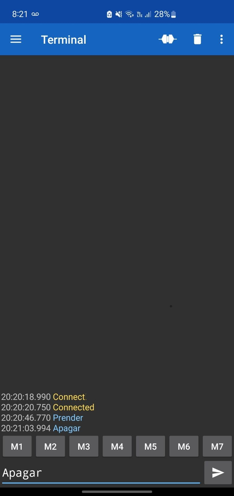
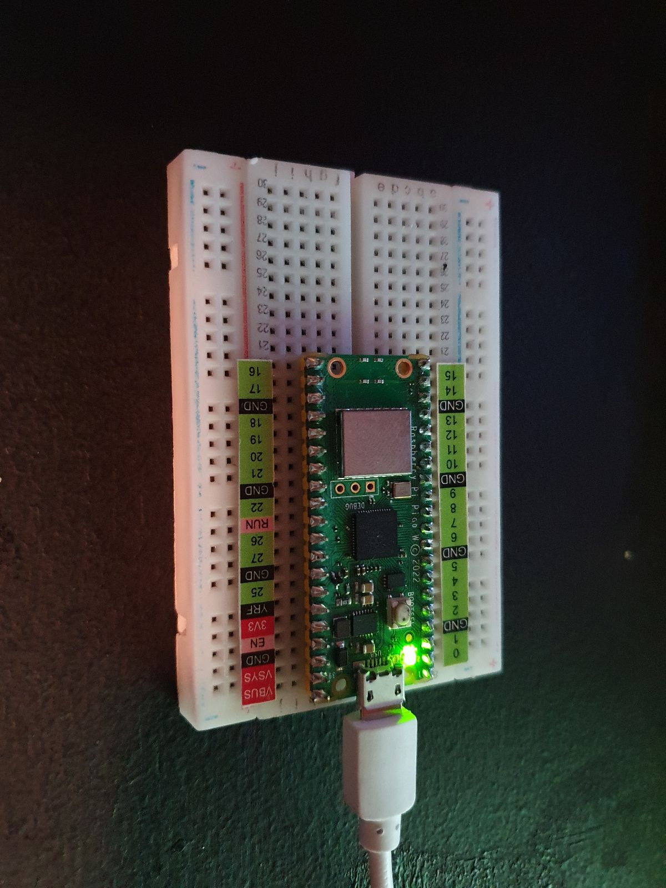
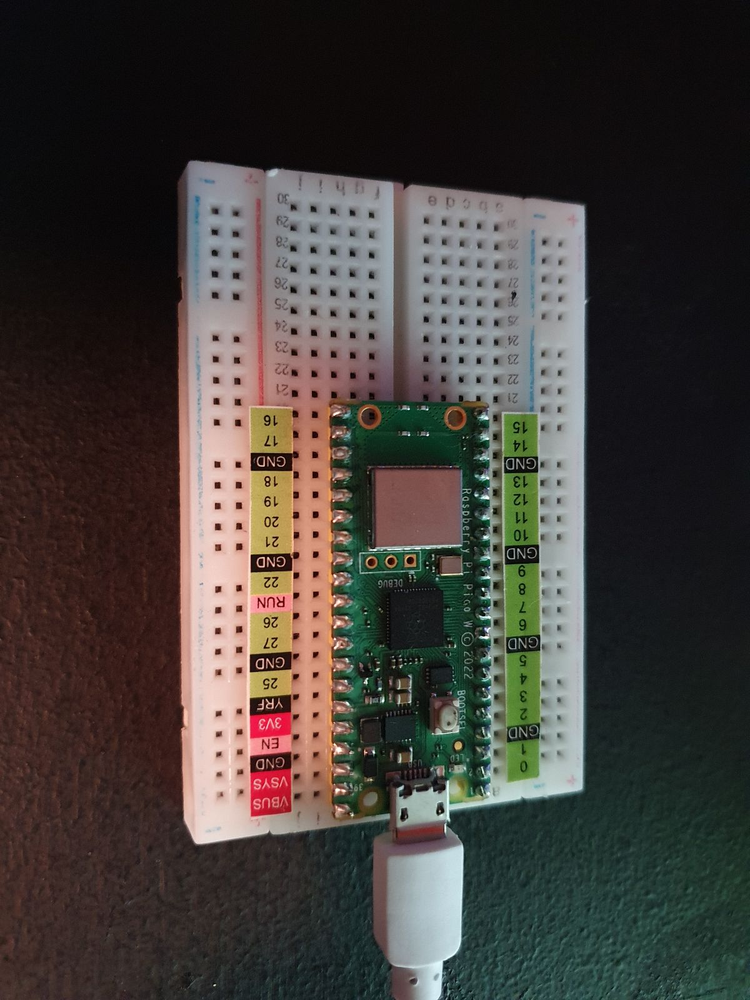

# Práctica-2.6

# 2.6 Bluetooth + LED (blink) via App (o Flask u otro medios)  móvil /laptop
Depto de Sistemas y Computación  
Ing. En Sistemas Computacionales  
SISTEMAS PROGRAMABLES 23a  
Autor: Jesús Elías Martínez  
Fecha de entrega:   26/10/2023  
Objetivo: Utiliza el Raspberry Pi Pico con Bluetooth para controlar de forma remota el LED Blink

**Código de thonny**   
Lenguaje: Phyton
```
#Elías Martínez Jesús  -   20211768

#Importación de librerías
import bluetooth
import random
import struct
import time
from machine import Pin
from ble_advertising import advertising_payload
from micropython import const

#Constantes relacionados con eventos de interrupción de BLE
_IRQ_CENTRAL_CONNECT = const(1)
_IRQ_CENTRAL_DISCONNECT = const(2)
_IRQ_GATTS_WRITE = const(3)

#Constantes en hexadecimal, características
_FLAG_READ = const(0x0002)
_FLAG_WRITE_NO_RESPONSE = const(0x0004)
_FLAG_WRITE = const(0x0008)
_FLAG_NOTIFY = const(0x0010)

#Identificador único de servicios
_UART_UUID = bluetooth.UUID("6E400001-B5A3-F393-E0A9-E50E24DCCA9E")
#Transmitir
_UART_TX = (
    bluetooth.UUID("6E400003-B5A3-F393-E0A9-E50E24DCCA9E"),
    _FLAG_READ | _FLAG_NOTIFY,
)
#Recibir
_UART_RX = (
    bluetooth.UUID("6E400002-B5A3-F393-E0A9-E50E24DCCA9E"),
    _FLAG_WRITE | _FLAG_WRITE_NO_RESPONSE,
)
#UUID del servicio UART y una tupla que contiene las características UART TX y RX
_UART_SERVICE = (
    _UART_UUID,
    (_UART_TX, _UART_RX),
)


class BLESimplePeripheral:
    #Función donde se determina como se llamará el bluetooth
    def __init__(self, ble, name="LED-BLINK"):
        self._ble = ble
        self._ble.active(True)
        self._ble.irq(self._irq)
        ((self._handle_tx, self._handle_rx),) = self._ble.gatts_register_services((_UART_SERVICE,))
        self._connections = set()
        self._write_callback = None
        self._payload = advertising_payload(name=name, services=[_UART_UUID])
        self._advertise()
    
    #Conexión de dispositivos centrales, desconexiones y escritura de datos en el periférico
    def _irq(self, event, data):
        if event == _IRQ_CENTRAL_CONNECT:
            conn_handle, _, _ = data
            print("Conexión nueva", conn_handle)
            self._connections.add(conn_handle)
        elif event == _IRQ_CENTRAL_DISCONNECT:
            conn_handle, _, _ = data
            print("Desconectado", conn_handle)
            self._connections.remove(conn_handle)
            self._advertise()
        elif event == _IRQ_GATTS_WRITE:
            conn_handle, value_handle = data
            value = self._ble.gatts_read(value_handle)
            if value_handle == self._handle_rx and self._write_callback:
                self._write_callback(value)
    
    #Función de envío
    def send(self, data):
        for conn_handle in self._connections:
            self._ble.gatts_notify(conn_handle, self._handle_tx, data)
    
    #Función conectar
    def is_connected(self):
        return len(self._connections) > 0
    
    #Función desconectar
    def is_disconnected(self):
        return len(self._connections) < 0 

    #Hace público el dispositivo
    def _advertise(self, interval_us=500000):
        print("Bluetooth visible")
        self._ble.gap_advertise(interval_us, adv_data=self._payload)

    #Manejaeventos de escritura
    def on_write(self, callback):
        self._write_callback = callback

#Fucnión para el envio y verificación de infomración
def demo():
    led_onboard = Pin("LED", machine.Pin.OUT)
    ble = bluetooth.BLE()
    p = BLESimplePeripheral(ble)
    
    #Función para envio
    def on_rx(v):
        print("RX", v)
        #Selectiva de envio de texto desde app
        if v == b'Prender\r\n':
            led_onboard.on()
            print("LED encendido")
        elif v == b'Apagar\r\n':
            led_onboard.off()
            print("LED apagado")
        else:
            print("Comando incorrecto")

    p.on_write(on_rx)
    
    while True:
        pass

#Selectiva para llamar
if __name__ == "__main__":
    demo()
```

**Resultados**  
_APP_  
Bluetooth Serial Termianl  
  

_LED BLINK ENCENDIDO_  
   

_LED BLINK APAGADO_  
   
